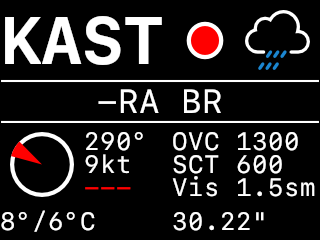

PiWx: Raspberry Pi Aviation Weather
===================================

PiWx is a configurable aviation METAR display designed to work with the
Adafruit 320x240 PiTFT framebuffer display. While PiWx is hard-coded to work
with the PiTFT, it should not be difficult to modify it for any display that
uses a framebuffer device.

For more information about the PiTFT: <https://www.adafruit.com/product/2298>.

The amazing weather icons are from the Weather Underground Icons project:
<https://github.com/manifestinteractive/weather-underground-icons>

The font used is San Francisco Monospace (SF Mono) from Xcode.

NOTICE
------

Use of this program in no way satisfies any regulatory requirement for pre-
flight planning action in any country.

Building
--------

PiWx uses CMake 3.22 to build. The following dependencies must be installed:

* pigpio (<https://abyz.me.uk/rpi/pigpio/>)
* Bison (<https://www.gnu.org/software/bison/>)
* Flex (<https://github.com/westes/flex>)
* LibXml2 (<http://www.xmlsoft.org/>)
* libcURL (<https://curl.haxx.se/libcurl/>)
* libpng (<http://www.libpng.org/pub/png/libpng.html>)
* ws2811 [optional] (<https://github.com/jgarff/rpi_ws281x.git>)

After cloning the repository, use the following commands to perform a simple
build:

    % git clone https://github.com/slakpi/piwx.git
    % cd piwx
    % mkdir build
    % cd build
    % cmake -DCMAKE_INSTALL_PREFIX="/usr/local/piwx" -DCMAKE_BUILD_TYPE=Release ..
    % make
    % sudo make install

LED support requires the `ws2811` library listed above. If the `ws2811` library
is available on the system, PiWx will build with LED support enabled.

Configuration
-------------

Configuration is relatively simple. Refer to the sample configuration file that
installs to the `etc` directory under the install prefix. Simply copy the
sample to a new file called `piwx.conf`.

    # Comma-separated list of aiports; used directly in the URL query.
    stations="KHIO,KMMV,KUAO,KVUO,KSLE,KSPB,KTPA,KCGC,KGNV,KDEN";

    # Airport METAR display cycle time in seconds.
    cycletime=5;

With LED support enabled, `piwx` will drive a 50-LED WS281x strip to display
flight categories at select airports. The `led<num>` option assigns an airport
to a LED where `<num>` is a number between 1 and 50 inclusive.

    # Assign LEDs
    led1="KHIO";
    led5="KMMV";
    led6="KUAO";
    ...

It is not necessary to assign LEDs sequentially. Unassigned LEDs will just
remain off. `piwx` supports a brightness option with 256 levels of brightness
where 0 or `off` is off and 255 is full intensity.

    # Set LED brightness
    brightness=64;

PiWx calculates sunrise / sunset information for each airport in the station
list. This allows automatically dimming the LEDs at night with the night
brightness option:

    # Set night brightness
    nightbrightness=8;

When PiWx determines that it is night at an airport, it will switch to using the
specified night brightness level.

Flight category colors, both LED and weather display, are currently fixed to
the US National Weather Service colors: Green (VFR), Blue (Marginal VFR),
Red (IFR), and Purple (Low IFR). The `highwindspeed` option may be used to
color airports using Yellow if the wind or gust speed meets or exceeds the
setting. By default, this value is 25 knots.

    # Set high-wind threshold
    highwindspeed=30;

Setting `highwindspeed` to `off` disables the high-wind warning:

    # Disable high-wind warning
    highwindspeed=off;

The `highwindblink` option enables alternating airports between the high-wind
warning and the flight category color. For example, with blinking enabled, a
VFR airport with high winds will alternate between Green and Yellow.

    # Enable high-wind blinking
    highwindblink=on;

Setting `highwindblink` to `off` disables blinking and airports with high winds
will just display Yellow:

    # Disable high-wind blinking
    highwindblink=off;

By default, `piwx` uses GPIO18 and DMA Channel 10 to drive the LED string.
These may be configured using the following options:

    # Set LED GPIO pin to GPIO12 (BE CAREFUL)
    ledpin=12;
    # Set LED DMA channel (BE CAREFUL)
    leddma=10;

BE EXTREMEMLY CAREFUL when choosing the DMA channel. Read up on the available
DMA channels. `piwx` currently only supports GPIO12 and GPIO18 (PWM0). The
default options are the safest. Leave these options alone unless there is a
compelling option to change them.

`piwx` can log basic events to `<prefix>/var/piwx/piwx.log`. The logger supports
four levels of output: `quiet` (default), `warning`, `info`, and `debug`. Each
level of debug suppresses the levels above it, e.g. `warning` suppresses `info`
and `debug` messages.

    # Log warning and informational messages
    loglevel=info;

Running Automatically
---------------------

To run PiWx automatically on boot, refer to the sample service file in the
repository under `support/systemd`. This file must be placed in
`/lib/systemd/system` and renamed to `piwx.service`.

Use `sudo systemctl start piwx.service` to test starting PiWx and use
`sudo systemctl stop piwx.service` to stop it. To enable automatically starting
PiWx on boot, use `sudo systemctl enable piwx.service`.
